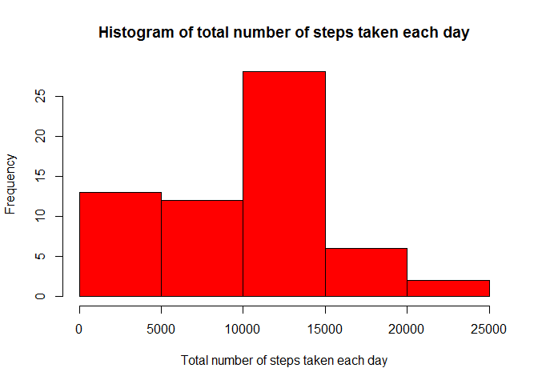
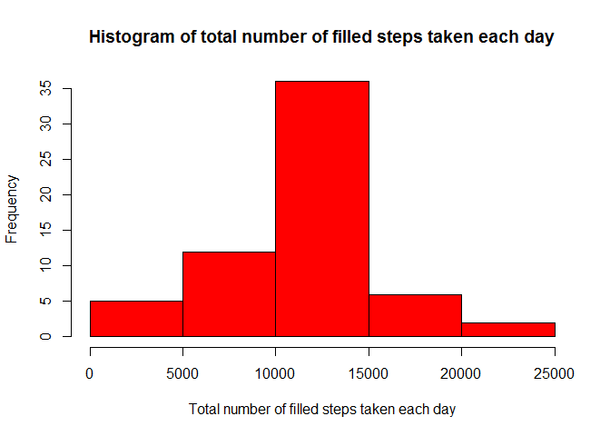

# Reproducible Research: Peer Assessment 1

```r
library(knitr)
opts_chunk$set(echo=TRUE)
options(scipen = 999, digits = 4)
```

## Loading and preprocessing the data

```r
activityDF <- read.csv("activity.csv")
stepsByDay <- aggregate(activityDF$steps, by = list(date = activityDF$date),
                        FUN = sum, na.rm = TRUE)
hist(stepsByDay$x, col = "red", xlab = "Total number of steps taken each day",
     main = "Histogram of total number of steps taken each day")
```

<!-- -->

## What is mean total number of steps taken per day?

```r
meanStepsByDay <- mean(stepsByDay$x)
medianStepsByDay <- median(stepsByDay$x)
```
Mean number of steps taken each day = 9354.2295  
Median number of steps taken each day = 10395

## What is the average daily activity pattern?

```r
stepsBy5MinInt <- aggregate(activityDF$steps, by = list(interval =
                        activityDF$interval), FUN = mean, na.rm = TRUE)
plot(stepsBy5MinInt$interval, stepsBy5MinInt$x, type = "l",
     ylab = "5 min average steps across all days", xlab = "5 min interval")
```

<!-- -->

## Imputing missing values

```r
good <- complete.cases(activityDF)
missingCount <- nrow(activityDF[!good, ])
avgStepsByInt <- aggregate(activityDF$steps, by = list(interval = activityDF$interval),
                        FUN = mean, na.rm = TRUE)

len <- nrow(activityDF)
stepsFilled <- vector(mode = "integer", length = len)
for (i in 1:len) {
        if (is.na(activityDF$steps[i])) {
                indx <- which(avgStepsByInt$interval == activityDF$interval[i])
                if (!is.nan(avgStepsByInt$x[indx]))     {
                        stepsFilled[i] <- round(avgStepsByInt$x[indx])
                }
                else    {
                        stepsFilled[i] <- 0
                }
        }
        else    {
                stepsFilled[i] <- activityDF$steps[i]
        }
}

filledActivityDF <- activityDF
filledActivityDF$steps <- stepsFilled
stepsByDay <- aggregate(filledActivityDF$steps, by = 
                                list(date = filledActivityDF$date), FUN = sum)

hist(stepsByDay$x, col = "red", xlab = "Total number of filled steps taken each day",
     main = "Histogram of total number of filled steps taken each day")
```

<!-- -->

```r
meanStepsByDay <- mean(stepsByDay$x)
medianStepsByDay <- median(stepsByDay$x)
```

Total missing or NA count of activities = 2304  
**Missing value imputed using mean value for the given interval**  
Mean number of steps taken each day after imputing missing values = 10765.6393  
Median number of steps taken each day after imputing missing values = 10762

## Are there differences in activity patterns between weekdays and weekends?


```r
filledActivityDF$dayInd <- factor(ifelse(weekdays(as.Date(filledActivityDF$date,
                                        "%Y-%m-%d"), abbreviate = TRUE) %in%
                                        c("Sat", "Sun"), "weekend", "weekday"))
stepsBy5MinInt <- aggregate(filledActivityDF$steps, by = list(interval =
                        filledActivityDF$interval,
                        dayInd = filledActivityDF$dayInd), FUN = mean)


library(lattice)
xyplot(x ~ interval | dayInd, data=stepsBy5MinInt, xlab="Interval",
       ylab="Number of steps", layout=c(1,2), type="l")
```

<!-- -->
